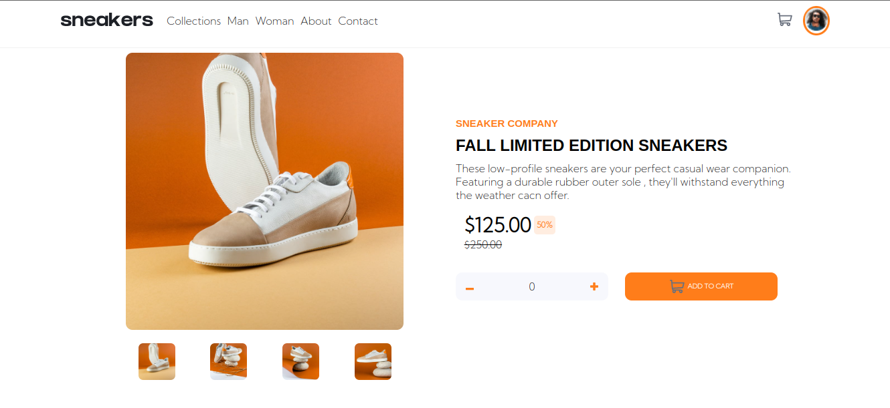

# E-commerce Product's Page

Product's Page section of an E-commerce Application .

### ScreenShot



### Functionalities Implemented

- Adding Item to Cart.
- Removing Item From Cart.
- Displaying Total Number Of Item Present In Cart.
- Displaying Total Cost Of All Items Present In Cart.
- Increasing And Decreasing Quantity Of Item In Cart.
- Display Carousel for Mobile , Customized Carousel for Desktop.

### Links

- Solution URL: [https://github.com/jerncomania28/ecommerce-products-page](https://github.com/jerncomania28/ecommerce-products-page)
- Live Site URL: [https://candid-profiterole-dabc72.netlify.app/](https://candid-profiterole-dabc72.netlify.app/)

## Process

- Figured states that will be needed globally.
- Determined the best file structure.
- Deliberate what state management concept will be best suited e.g Contect API or Redux .
- Implemented Redux Having Scalability In Mind.
- started Designing Components Based on The UI.
- collated and carefully fix the Independent Components to it's required sections.
- Worked on all action functions in the global states .
- Integrated them into the created Components.

### Built with

- Semantic HTML5 markup
- CSS custom properties
- Flexbox
- Mobile-first workflow
- Redux
- sass
- [React](https://reactjs.org/) - JS library

### What I learned

- Modern way of Implementing Redux in a React Project.
- Working with Multple Sass Partials.
- Understood what web Accessibility and Semantic HTML.

```sass
 _components.scss
 _pages.scss
```

### Continued Development 

- State Mangement e.g Redux.
- Typescript in React.
